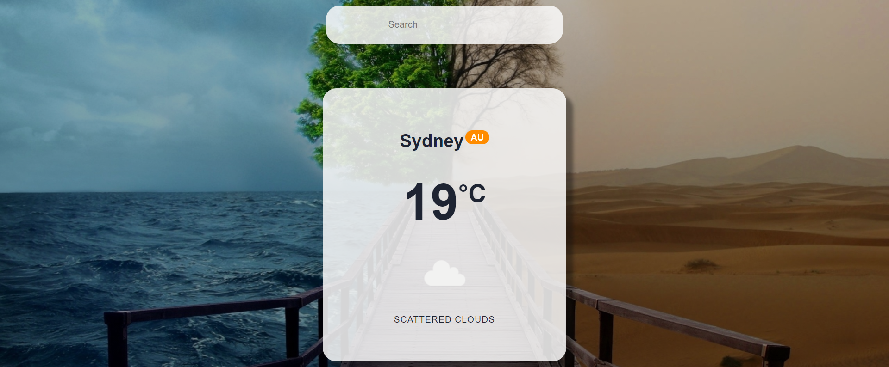

#Progressive Web Application

link :
https://coco-pwa-weatherapp.netlify.app/

##Introduction
React application, Weather API

Create a servieWorker and mainifest.json

Pass all checks in Google lighthouse Audit

It can be install as Desktop application and mobile application.

